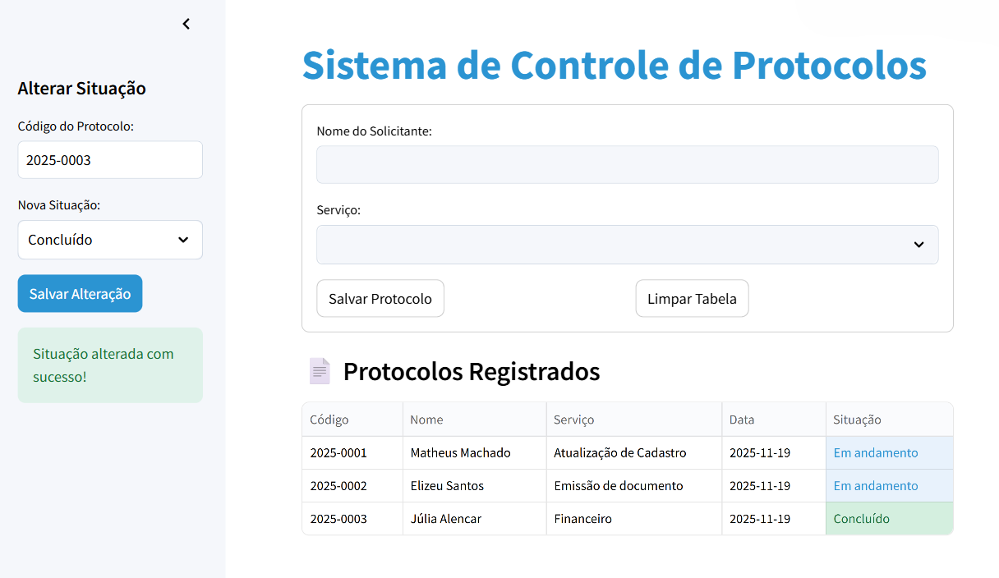

# Sistema de Controle de Protocolos

Aplicação desenvolvida em **Python** com **Streamlit** para registrar, listar e buscar protocolos de atendimento de forma simples, rápida e totalmente online.  
O objetivo do projeto é oferecer uma forma organizada de controlar solicitações, combinando **praticidade**, **visual limpo** e **interatividade na tabela de dados**.

---

## 🌐 Acesse o Projeto Online

[Clique aqui para usar o Sistema. (Ctrl + clique para abrir em uma nova aba)](https://matheus-machado-sistema-de-controle-de-protocolos.streamlit.app/)

Nenhuma instalação ou download é necessário, o projeto é executado diretamente no navegador por meio do **Streamlit Cloud**, garantindo fácil acesso e compatibilidade com qualquer dispositivo.

---

## ⚙️ Tecnologias Utilizadas

### 🐍 **Python 3**

Responsável por toda a lógica da aplicação: geração de códigos, tratamento das entradas do usuário e regras de negócio.

### 💻 **Streamlit**

Framework utilizado para transformar o script Python em uma aplicação web interativa, com formulários, sidebar e exibição de tabelas em tempo real.

### 🧮 **Pandas**

Usado para armazenar e manipular os protocolos em um **DataFrame**, permitindo organizar os dados em formato de tabela e aplicar filtros de forma simples.

### ⏱️ **datetime**

Biblioteca utilizada para registrar automaticamente a **data de criação** de cada protocolo salvo no sistema.

### 🎨 **CSS customizado (`styles.css`)**

A interface foi personalizada com foco em **clareza visual** e **experiência do usuário (UX)**:

- campos de formulário com realce em azul ao focar  
- botões com destaque e feedback visual no hover  
- hierarquia visual simples, com título em evidência e seções bem separadas  

A ideia foi deixar o uso do sistema mais intuitivo, reduzindo ruídos visuais e aproximando a interface de um painel moderno de controle.

---

## 🧠 Como o Sistema Funciona

O fluxo básico da aplicação é o seguinte:

1. O usuário preenche o **nome do solicitante** e escolhe o **tipo de serviço**.
2. Ao salvar, o sistema:
   - gera automaticamente um **código sequencial** no formato `2025-0001`, `2025-0002`, …  
   - registra a **data atual**  
   - define a **situação inicial** como `Em andamento`  
3. Os dados são armazenados em um **DataFrame do Pandas**, mantido na sessão através do `st.session_state`.
4. Todos os protocolos são exibidos em uma **tabela interativa**, permitindo visualizar, explorar e buscar informações.

A situação dos protocolos pode ser alterada a qualquer momento pela **sidebar**, informando o código e escolhendo uma nova situação.

---

## 📊 Tabela Interativa e Recursos Extras

A exibição dos dados é feita com `st.dataframe`, que adiciona recursos automáticos para o usuário, como:

- **Redimensionar** as colunas  
- **Reorganizar** visualmente as informações (ordem alfabética ou classificação numérica)   

Esses recursos são disponibilizados pela própria tabela interativa, permitindo que o usuário explore os dados sem precisar escrever código.

Além disso, as células da coluna **“Situação”** recebem cores diferentes com base no estado:

- Azul claro para **Em andamento**  
- Verde para **Concluído**  
- Vermelho suave para **Cancelado**

Isso facilita a leitura e o entendimento visual dos protocolos.

---

## 🔍 Busca de Protocolos

A aplicação também possui uma seção específica para **busca**, onde o usuário pode:

- digitar parte do **código** do protocolo  
- ou parte do **nome** do solicitante  

O sistema filtra os resultados e exibe apenas os protocolos que correspondem ao termo informado.  
Se não houver nenhum resultado, uma mensagem amigável informa que nada foi encontrado.

---

## Limpeza e Confirmação

Para evitar exclusões acidentais, o botão **“Limpar Tabela”** não apaga diretamente os dados.  
Ao clicar, o sistema:

1. Ativa um modo de **confirmação de limpeza**  
2. Exibe um aviso em destaque  
3. Mostra dois botões:
   - ✅ *“Sim, apagar tudo”*  
   - ❌ *“Cancelar”*  

Somente se o usuário confirmar é que todos os protocolos são removidos da tabela.

---

## 📜 Sobre a criação

Este projeto foi criado com fins **educacionais** e **demonstrativos**.
